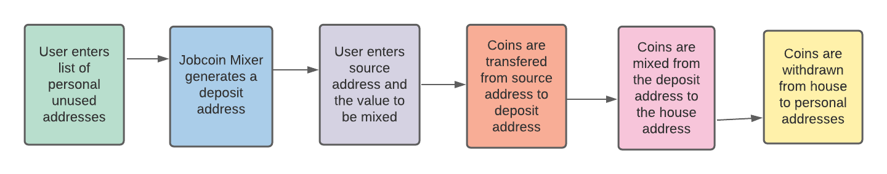
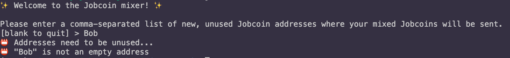
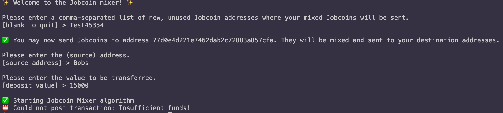
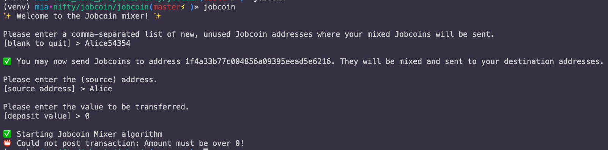

## jobcoin: a cryptocurrency coin mixer

<br>
<p align="center">

</p>
<br>

#### 👉🏼 cryptocurrency coins operate on a pseudonymous system, not an anonymous protocol, so our coin mixer proof-of-concept offers an approach to enhance privacy on the network—for a small fee 😉

<br>

---

### setting up

<br>

* set up your `.env` file

```
cp .env_sample .env
make install
```

* with the following variables:

```
API_ADDRESS_URL = ''
API_TRANSACTIONS_URL = ''
SIGNIFICANT_DIGITS = 17
HOUSE_ADDRESS = 'Jobcoin-House'
FEE_PERCENTAGE = 0.1
WITHDRAW_MAX_VALUE = 1
```

<br>

##### `HOUSE_ADDRESS`

* the ephemeral `hex` *deposit address* moves the coins to this address, where it's then mixed with other coins


##### `SIGNIFICANT_DIGITS`

* as Jobcoin Mixer deals with float transactions, this variable sets the desired precision when converting strings to float

##### `FEE_PERCENTAGE`

* an integer number representing the percentage fee to be collected for the mixing service (set to 0 for no fee)


##### `MAX_WITHDRAW_VALUE`

* set the value for small withdrawal values for which Jobcoin Mixer will move from the House address to each personal addresses
* jobcoin Mixer *cares about your privacy*, so setting this to smaller values makes the transactions more discrete
* f you would like to have Jobcoin Mixer withdrawing all coins in one unique transaction, simply leave this constant empty (`None`)

<br>

----

### running

<br>

```
jobcoin
```

<br>

---

### usage

<br>

* successful flow

<p align="center">

</p>

<br>

* personal address is not unused

<p align="center">

</p>

<br>

* insufficient funds

<p align="center">

</p>

<br>

* given coin amount is zero

<p align="center">

</p>

<br>

----

### developer corner

<br>

* running a linter

```
make lint
```
<br>

* running unit tests

```
make test
```

<br>

* cleaning dist, dev, test, files

```
make clean
```

<br>

---

### open tasks

<br>

* improve unit tests. Add missing tests for `test_jobcoin.py`, `test_cli.py`, and `test_util.py`; add tests for failures and success, with better mocking and fixtures
* improve private method `_is_empty()` as it loops over all the transactions address; as the list increases, this will take too long
* deal with the increased size of the list of transactions being pulled from the server every time
* convert the code to pure Python 3 (e.g., `-> return` in the module name, etc.); make sure the dependencies install Python3 libraries
* adding `logging` everywhere, with different types of logging levels
* Iimprove rules for linting

